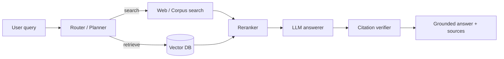

<!--
  ============================================================
  Reusable project README template — copy this into each pinned repo.
  Replace every {{placeholder}}. Sections marked OPTIONAL can be deleted
  if not applicable, but the structure should stay intact.
  ============================================================
-->

<div align="center">

<h1>{{Project Name}}</h1>

<p><em>{{One-sentence value prop: what it does + the headline result.}}</em></p>

<!-- Badges: tech stack + status -->
<p>
  
  
  
  
  
</p>

<!-- Demo image / GIF — replace with your own -->


<p>
  <a href="{{LIVE_DEMO_URL}}"><b>Live demo</b></a> ·
  <a href="#results">Results</a> ·
  <a href="#architecture">Architecture</a> ·
  <a href="#run-it-locally">Run it</a> ·
  <a href="{{BLOG_POST_URL}}">Writeup</a>
</p>

</div>

---

## Why this exists

{{2–4 sentences. The problem in the world, not the problem in your bootcamp. Who would use this, what gets better when they do, and what made the existing solutions inadequate. Avoid "I built this to learn X" — recruiters want to see product thinking.}}

## What it does

- {{Capability one — phrased as user outcome, not tech.}}
- {{Capability two.}}
- {{Capability three.}}

## Results

| Metric | Baseline | This project | Δ |
|---|---|---|---|
| {{Factuality (RAGAS)}} | {{0.62}} | **{{0.81}}** | +{{30%}} |
| {{Context recall@5}} | {{0.71}} | **{{0.88}}** | +{{24%}} |
| {{End-to-end p95 latency}} | {{4.2s}} | **{{1.8s}}** | -{{57%}} |
| {{Cost per 1k queries}} | {{$2.10}} | **{{$0.45}}** | -{{79%}} |

> Numbers are from {{eval set name + size}}, run on {{date}}. Reproduce with `python -m eval.run --config configs/eval.yaml`.

## Architecture



{{One paragraph explaining a non-obvious design choice. Example: "We use hybrid BM25+dense retrieval because pure dense retrieval missed exact-match identifiers (CVE IDs, drug names) in 18% of test queries."}}

## Tech stack

- **LLM** — {{OpenAI gpt-4o-mini, Claude Haiku, Llama-3-8B}}
- **Retrieval** — {{Chroma + BM25 hybrid, Cohere rerank-v3}}
- **Orchestration** — {{LangGraph}}
- **API** — {{FastAPI}}
- **Frontend** — {{Streamlit}}
- **Eval** — {{Ragas + custom citation-correctness metric}}
- **Observability** — {{Langfuse}}

## Run it locally

```bash
git clone https://github.com/mohitgrovercodes/{{repo-name}}.git
cd {{repo-name}}
cp .env.example .env  # add your API keys
docker compose up -d
# or, without docker:
pip install -r requirements.txt
uvicorn app.main:app --reload
```

Open `http://localhost:8000` and try the sample queries in `examples/`.

## Project structure

```
{{repo-name}}/
├── app/              # FastAPI service
├── core/             # LLM + retrieval logic
├── eval/             # Eval datasets, runners, metrics
├── configs/          # YAML configs for runs
├── docs/             # Architecture notes, demo assets
├── notebooks/        # Exploration only (kept clean)
└── tests/
```

## Evaluation methodology

{{Explain the eval set: where it came from, size, how you split, and how you guard against contamination. This is the section that separates serious projects from demos. 3–6 sentences.}}

## What I'd do next

- {{Honest next step — shows self-awareness without selling the project short.}}
- {{Second next step — points at a future direction, not a bug.}}

## Acknowledgements

- {{Paper, dataset, or library you built on top of, with link.}}
- {{Any code you adapted (and the license).}}

## License

MIT — see [LICENSE](LICENSE).

---

<div align="center">
  <sub>Built by <a href="https://github.com/mohitgrovercodes">@mohitgrovercodes</a> · Questions welcome via Issues.</sub>
</div>
